# 基于webpack的前端工程化开发和实践

## 背景
前端经历了初期的野蛮生长（切图，写简单的特效）——为了兼容浏览器兼容性而出现的各种类库（JQUERY,YUI等——mv*（代码多了，也就想到怎样组织代码结构，backbone，angularjs，react等）——工程化（利用grunt，gulp，yeoman,webpack做项目脚手架以及打包部署），在对全端化、全栈化以及工程化的要求日益增高下，我们希望能探索出一套比较友好而且完善的解决方案，去支持我的业务场景，用尽量少的配置，尽量简单的使用命令，能覆盖到我们前端开发的方方面面，同时与服务端之间进行友好的协作。

## 工程化
> 软件工程是一门研究用工程化方法构建和维护有效的、实用的和高质量的软件的学科。
> 目的是在给定成本、进度的前提下，开发出具有可修改性、有效性、可靠性、可理解性、可维护性、可重用性、可适应性、可移植性、可追踪性和可互操作性并满足用户需求的软件产品。
> [软件工程释义](http://baike.baidu.com/link?url=8KWAhpkQgUuyqAdcnb0Y380yJ5Ol8pY1-cGPR_iegeVsmnskjrZPiTLsVavNguvCSwBzhLFpUMFtOK0EiQtmAcGQRREMQa6PqF-4L62jQqC)_


### 相关要素

不同的研发岗位和技术分工都会根据自身的需求去具体落实工程化的相关实现

结合当前项目的具体分工情况，需要落实的地方有如下几个方面:

* 功能细分化，技术全栈化，人人产品化
* 功能完善的IDE，能快速方便的完成代码的结构与组织，语法检测，编译与调试，打包构建等，覆盖整个开发流程;
* 有固定或者约定的工程模式，规定软件所依赖的不同类别的资源的存放路径和代码的组织方式等,并且可以通过脚手架实现项目的快速初始化;
* 快速集成各种资源的能力，完成对资源的获取、打包、发布、版本管理等能力；
* 和其他系统的集成，如CI系统、上线系统、运维系统、监控系统等；


## 前端的工程化

前端是一种特殊的GUI软件，它有两个特殊性：一是前端由三种编程语言组成，二是前端代码在用户端运行时增量安装。html、css和js的配合才能保证webapp的运行，增量安装是按需加载的需要。开发完成后输出三种以上不同格式的静态资源，静态资源之间有可能存在互相依赖关系，最终构成一个复杂的资源依赖。

* 提供开发所需的一整套运行环境;
* 资源管理，包括资源获取、依赖处理、实时更新、按需加载、公共模块管理等；
* 打通研发链路的各个环节，compile、debug、mock、proxy、test、build、deploy等；

## 资源管理

<strong>资源管理</strong>和<strong>前端组件化</strong>是目前每个前端工程项目都需要直接面对的两大问题，前者主要解决的是效率问题，后者解决前段代码复用的问题。
目前效率工程这边的前端项目主要以webpack作为前端自动化工具（可组合gulp,yeoman,mockserver等）管理资源，以react+redux来实现代码的组件化，相对于grunt,gulp,requires/seajs,bower等资源包管理工具，webpack具备如下几点优势：

* 资源管理功能强大，兼容AMD,CMD,commonJS等多种标准;
* 串联式模块加载器以及插件机制，让其具有更好的灵活性和扩展性，例如提供对CoffeeScript、ES6的支持；
* 可以基于配置或者智能分析打包成多个文件，实现公共模块或者按需加载；
* 支持对CSS，图片等资源进行打包，从而无需借助Grunt或Gulp；
* 开发时在内存中完成打包，性能更快，完全可以支持开发过程的实时打包需求；
* 能非常方便的与react协作开发


快速安装：

```
$ npm install -g webpack webpack-dev-server
```

package.json可以加入一个script字段作为开发命令

```js
"scripts": {
   "start": "webpack-dev-server --hot --progress --colors",
   "build": "NODE_ENV=production webpack --progress --colors"
}
```

项目运行执行如下命令即可：

```shell
npm run start 　# 项目启动
npm run build　 # 项目编译
```

其他常用[构建参数](http://webpack.github.io/docs/cli.html)释义：

```shell
$ webpack --display-error-details  # 方便出错时能查阅更详尽的信息（如寻找模块的过程），从而更好定位到问题。
$ webpack --watch  # 监听变动并自动打包
$ webpack -p  # 压缩混淆脚本
$ webpack -d  # 生成map映射文件
$ webpack -colors  # 命令带色彩高亮显示
```

### 文件配置
每个项目下都必须配置有一个 webpack.config.js ，它的作用如同常规的 gulpfile.js/Gruntfile.js ，就是一个配置项，告诉需要webpack需要如何构建当前的任务和开发信息。


### webpack的资源引用

>1. 根据webpack的设计理念，所有资源都是“模块”，webpack内部实现了一套资源加载机制，不同的资源可以采用不同的loader。

>1. 除了借助插件体系加载不同类型的资源文件之外，webpack还对输出结果提供了非常精细的控制能力，开发者只需要根据需要调整参数即可。

>1. 配置好特定类型的资源对应的loaders，在业务代码直接使用webpack提供的require（source path）接口即可

>1. 通过loader机制，可以不需要做额外的转换即可加载浏览器不直接支持的资源类型，如.scss、.less、.json、.ejs等

```js
module: {
    loaders: [
      {
        test: /\.js[x]?$/,	// 表示匹配的资源类型
        exclude: /node_modules/,　// 表示需要排除的查找目录
        include: __dirname,　　// 表示需要包含查找目录
        loader: 'react-hot!babel-loader?presets[]=es2015&presets[]=react' // 表示用来加载这种类型的资源的loader 
      },
      {
        test: /\.json$/,
        loader: 'json-loader'
      },
      {
        test: /\.less$/,
        loader: isDebug ? 'style!css!less' :　// style-loader会以内联资源的形式插入到页面的head中
          ExtractTextPlugin.extract('style-loader', 'css-loader!less-loader')
      },
      {
        test: /\.css$/,
        loader: isDebug ? 'style-loader!css-loader' :
          ExtractTextPlugin.extract('style-loader', 'css-loader')
      },
      {
        test: /\.(jpeg|jpg|png|gif)$/,
        loader: 'url?limit=8192&name=images/[hash:8].[name].[ext]'
      },
      {
        test: /\.woff(\?v=\d+\.\d+\.\d+)?$/,
        loader: 'url?limit=10000&mimetype=application/font-woff'
      },
      {
        test: /\.ttf(\?v=\d+\.\d+\.\d+)?$/,
        loader: 'url?limit=10000&mimetype=application/octet-stream'
      },
      {
        test: /\.svg(\?v=\d+\.\d+\.\d+)?$/,
        loader: 'url?limit=10000&mimetype=image/svg+xml'
      }
    ]
  }

// 页面资源引入
require('../../css/vendors.css');
require('../../less/style.less');
var MenuData = require('../data/tabTree.json'); // => return json object
var fileContent = require("raw!./file.txt"); // => return file.txt content as string

/* 注意，require()还支持在资源path前面指定loader，即require(![loaders list]![source path])形式：
 * require()时指定的loader会覆盖配置文件里对应的loader配置项。
 */

// “bootstrap.less”这个资源会先被"less-loader"处理，
// 其结果又会被"css-loader"处理，接着是"style-loader"
// 可类比pipe操作
require("!style!css!less!bootstrap/less/bootstrap.less");

```

### 注意事项

>1. webpack内部实现了一个全局的webpackJsonp()用于加载处理后的资源，并且webpack把资源进行重新编号，每一个资源成为一个模块，对应一个id

>1. 对于在css中引入的外部资源，通常需要借助url-loader进行加载并会对引入的资源进行分析，通过配置url?limit=10000&name=img/[hash:8].[name].[ext]这样的参数可以实现当文件小于指定大小时自动完成base64转码，大于则保留原始图像，并且借助[hash:8].[name].[ext]的格式配置，读取图片内容hashsum值的前8位，这样做能够保证引用的是图片资源的最新修改版本

>1. 对于css文件，默认情况下webpack会把css content内嵌到js里边，运行时会使用style标签内联。如果希望将css使用link标签引入，可以使用ExtractTextPlugin插件进行提取。

相关参阅资料

* [webpack的loader使用说明](http://webpack.github.io/docs/using-loaders.html)
* [webpack常用loader列表](http://webpack.github.io/docs/list-of-loaders.html)

### webpack的模块管理

>1. webpack同时提供了对CommonJS、AMD和ES6模块化标准的支持，对于非前三种标准开发的模块，webpack提供了shimming modules的功能。

>1. 受Node.js的影响，越来越多的前端开发者开始采用CommonJS作为模块开发标准，npm已经逐渐成为前端模块的托管平台,借用webpack我们可以把node_modules路径添加到resolve search root列表里边，这样就可以直接load npm模块.

>1. Webpack是使用类似Browserify的方式在本地按目录对依赖进行查找，通过配置extensions属性列表可以对需要查找的资源扩展名进行自动补全，如require('common')，webpack会自动在目录下尝试匹配查找common.js,common.jsx.common.json等文件。


```js
resolve: {
    root: [process.cwd() + '/dev', process.cwd() + '/node_modules'], // 绝对路径，资源的寻址会从这里开始查找
    extensions: ['', '.coffee', '.js', '.jsx', '.json'],
    alias: {
      'utils': 'js/libs/utils',
      'widget': path.join(__dirname, './dev/js', 'widget'),
      'mixins': path.join(__dirname, './dev/js', 'mixins'),
      'models': path.join(__dirname, './dev/js', 'models'),
    }
}

// 从node_modules中引入资源
import React from 'react';
import { Badge, Icon, Modal } from 'antd';

// 通过alias引入资源
import { Utils as util } from 'utils';
import Position from 'models/position';
import TextInput from 'widget/textInput';

// 使用commonJS的方式引入资源
childRoutes: [
  require('./routes/Recruitment'),
  require('./routes/Employee/'),
  require('./routes/MessageCenter/')
];
var $ = require('jquery');

// 使用amd的方式引入资源
define(function(require) {
    var $ = require('jquery');
    $('body').text('hello world');
});

```

## 资源的编译与输出

webpack中的一切资源皆被当做模块：

1. webpack的中的主要概念：模块（module）、入口文件（entry）、分块（chunk）、出口（output）。
2. module指各种资源文件，如js、css、图片、svg、scss、less等等，。

webpack编译输出的文件包括以下３种：

* entry：入口，可以是一个或者多个资源合并而成，由html通过script标签引入
* chunk：被entry所依赖的额外的代码块，同样可以包含一个或者多个文件
* filename：实际文件(图片，音频，视频，文本片段，css等，字体文件)

```js

module.exports = {
    // 入口，它定义了打包的入口文件，数组中的文件会按顺序进行，并且它会自行解决依赖问题。
    entry = {
      index: path.resolve(APP_PATH, 'index.js'),
      myInterviewList: path.resolve(APP_PATH, 'myInterviewList.js'),
      todayInterviewList: path.resolve(APP_PATH, 'todayInterviewList.js'),
      // 公用模块
      vendors: [
        'antd',
        'jquery',
        'utils',
        'underscore',
        path.resolve(CSS_PATH, 'vendors.css')
      ]
	},
    // 出口，它定义了输出文件的的位置，包括路径，文件名，还可能有运行时的访问路径（publicPath）参数。
    output: {
     path: path.resolve(ROOT_PATH, 'people'),
     filename: 'js/[name].js',
     publicPath: '/static/people/',
     chunkFilename: 'js/[chunkhash:8].chunk.js'
   }
};

```
其中entry项是入口文件路径映射表，output项是对输出文件路径和名称的配置，占位符如[id]、[chunkhash]、[name]等分别代表编译后的模块id、chunk的hashnum值、chunk名等，可以任意组合决定最终输出的资源格式。hashnum的做法，基本上弱化了版本号的概念，版本迭代的时候chunk是否更新只取决于chnuk的内容是否发生变化，下面即为webpack打包输出：

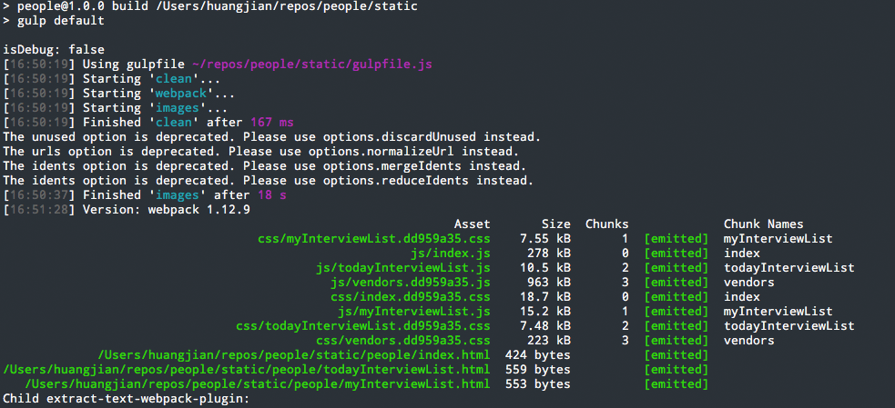

## 打包技巧
webpack中提供非常丰富的打包API和插件，充分利用好这些资源能极大的提升项目的构建输出效率与性能，其中有几个必须了解的打包理念如下介绍：

### chunk
在开发webapp时，通常脚本的体积会急剧增大，但是并非所有的功能都会在页面加载时即用到，出于性能优化的需要，对于这部分资源我们希望做成异步加载，所以这部分的代码一般不用打包到入口文件里边，webpack针对此种类型提供了成为[code splitting](http://webpack.github.io/docs/code-splitting.html)的代码切块方案，主要的api为：<strong>require.ensure(dependencies, callback)</strong>。

```js
 module.exports = {
  path: 'recruitment',
  getComponent(location, cb) {
    cb(null, require('./components/search'));
  },
  getChildRoutes(location, cb) {
    require.ensure([], (require) => {
      require('./routes/Position'),
      require('./routes/MailTemplate'),
      require('./routes/Talent'),
      require('./routes/Interview'),
      require('./routes/Offers'),
      require('./routes/OwnInterview/')
    });
  }
};
```
这样做的好处就是可以做到按需实现应用脚本资源的加载，典型的实用场景如下：

```js
 var component = getUrlQuery('component');
　if('dialog' === component) {
   require.ensure([], function(require) {
    　var dialog = require('./components/dialog');
   });
　}

  if('toast' === component) {
  　require.ensure([], function(require) {
     　var toast = require('./components/toast');
    });
  }
};
```

webpack会将require.ensure()包裹的部分单独打包了，即图中看到的[hash].chunk.js，既解决了异步加载的问题，又保证了加载到的是最新的chunk的内容。

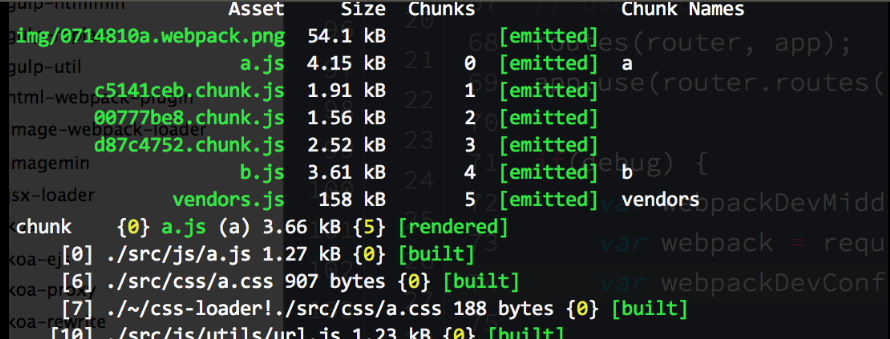

资源加载示意图：

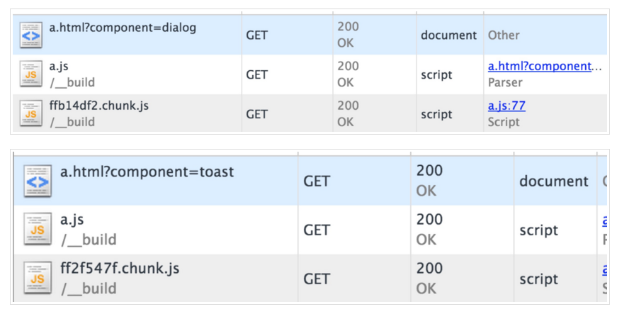

### commonsChunk
使用r.js打包AMD模块时遇到的资源重复打包的问题：
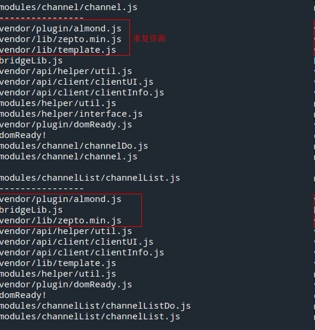

有时考虑类库代码的缓存和公共脚本资源的复用，比如多个页面的模块可能会公用一部分资源库（如:React,jQuery,underscore等），我们会通过使用commonsPlugin插件来分析模块的共用代码, 并且单独打一个包出来作为公用资源（放至CDN缓存）。

```js
var CommonsChunkPlugin = require("webpack/lib/optimize/CommonsChunkPlugin");
module.exports = {
    entry: {
        p1: "./page1",
        p2: "./page2",
        p3: "./page3",
        ap1: "./admin/page1",
        ap2: "./admin/page2"
    },
    output: {
        filename: "[name].js"
    },
    plugins: [
        new CommonsChunkPlugin("commons.js")
    ]
};
```

同时我们也可以通过使用Vendor chunk的方式，来自行控制common模块中的内容：

```js
var webpack = require('webpack');

module.exports = {
  index: path.resolve(APP_PATH, 'index.js'),
  myInterviewList: path.resolve(APP_PATH, 'myInterviewList.js'),
  todayInterviewList: path.resolve(APP_PATH, 'todayInterviewList.js'),
  // 公用模块
  vendors: [
    'antd',
    'jquery',
    'utils',
    'underscore',
    path.resolve(CSS_PATH, 'vendors.css')
  ]
};

plugins: [
  new CommonsChunkPlugin({
    name: 'vendors', // chunkname
    filename: 'js/vendors.js' // filename
  }),
]
```

详细资料可参阅：

* [multi-page-app](https://github.com/webpack/docs/wiki/optimization#multi-page-app)
* [optimizing-common-code](https://github.com/petehunt/webpack-howto#8-optimizing-common-code)


### UglifyJs
在完成项目模块打包后，通常我们需要对生产环境中的js代码进行压缩和混淆，可以借助UglifyJsPlugin对我们的工程代码进行压缩。

```js
var webpack = require('webpack');
var uglifyJsPlugin = webpack.optimize.UglifyJsPlugin;
module.exports = {
  entry: './main.js',
  output: {
    filename: 'bundle.js'
  },
  plugins: [
    new uglifyJsPlugin({
      compress: {
        warnings: false
      }
    })
  ]
};
```

### Externals
相对采用entry作为入口引入资源，我们经常也会引用外外连或者第三方网站的资源脚本（比如Google的Analytics,钉钉或微信的sdk脚本库,第三CDN上托管的资源文件等），因为没有走webpack的打包过程，这就需要我们手动将这些脚本的全局变量配置到我们的项目工程设置中才能在被工程项目识别,比如我们需要调用钉钉的sdk：

```shell
https://g.alicdn.com/ilw/ding/0.7.5/scripts/dingtalk.js
```

根据钉钉的要求，引入dingtalk.js后会得到一个全局的变量dd，那我们就需要在配置文件中加入：

```js
// webpack.config.js
module.exports = {
  entry: './main.js',
  output: {
    filename: 'bundle.js'
  },
  externals: {
    // require('data') 将作为一个externals,并被赋予变量进行访问
    'dd': 'dd'
  }
};
```

在实际工程中书写即：

```js
// main.js
var dd = require('dd');
console.log(dd.device);
```

### Environment flags
Webpack 提供的设置环境变量来优化代码的方案，通过配置在启动命令行前加上参数，引入魔法全局变量（magic globals）,就可以在代码读取相关环境信息来启动对应的功能（如在开发环境和生产环境中是否需要为资源增加hash值，css在开发环境中作为内联资源方便调试但是在生产环境中需要打包成独立文件等等）

```js
// definePlugin 会把定义的string 变量插入到Js代码中。
var definePlugin = new webpack.DefinePlugin({
  __DEV__: JSON.stringify(JSON.parse(process.env.DEBUG || 'true')),
  __PRERELEASE__: JSON.stringify(JSON.parse(process.env.PRERELEASE || 'false'))
});

module.exports = {
  entry: './main.js',
  output: {
    filename: 'bundle.js'
  },
  plugins: [definePlugin]
};
```

命令行运行时：

```shell
$ env DEBUG=true webpack-dev-server --progress --colors --hot
```

在实际工程代码中可以读取到:

```js
if (__DEV__) {
  // __DEV__ == true
  console.warn('Extra logging');
}
// ...
if (__PRERELEASE__) {
  showSecretFeature();
}
```

### ProvidePlugin
通常情况下我们都需要先require相关资源并赋值变量才能进行相关操作，如: var $=require('jquery'); 但是当我们很多页面都需要使用jquery或者在引入jquery插件时都需要重复定义难免会有些亢余，webpack提供了ProvidePlugin，只需要在配置文件中定义一次，即可在所有的模块中无需require直接使用。

```js
module.exports = {
  entry: './main.js',
  output: {
    filename: 'bundle.js'
  },
  plugins: [
	new webpack.ProvidePlugin({
	   $: "jquery",
	   jQuery: "jquery",
	   "window.jQuery": "jquery",
	   _: "underscore"
  	}),	
  ]
};
```

模块中无需require可使用：

```js
// main.js
$('h1').text('Hello World');

$('#exampleModal').modal({
	keyboard: false
});

_.each([1,2,3],function(v,i){
    console.log(v);
});
```

### HtmlWebpackPlugin
webpack来动态产生我们最终所期望的HTML文件，而不是指在浏览器运行时使用JS生成HTML片段，通过读取相关配置文件和信息，自动将打包后的资源路径和版本号写入HTML中，包括根据指定的模板，插入打包编译后CSS文件路径，插入打包生成的JS的文件路径。并且还需要为二者添加版本号等。

```shell
$ npm install html-webpack-plugin --save-dev
```

相关配置如下：

```js
module.exports = {
  entry: './main.js',
  output: {
    filename: 'bundle.js'
  },
  plugins: [
	new HtmlWebpackPlugin({
	  title: 'Bytedance People',
	  chunks: ['vendors', 'index'],
	  template: path.resolve(TMPL_PATH, 'index.html'), // 页面入口
	  filename: path.resolve(BUILD_PATH, 'index.html') // 页面出口',
     inject: true 
  	}),	
  ]
};
```

构建结果：
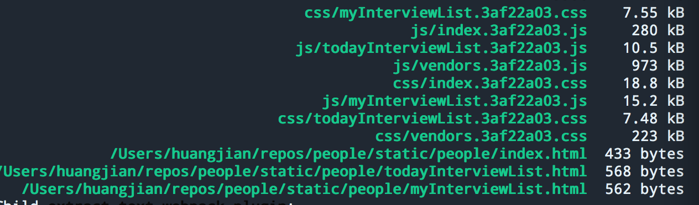


最终生成页面会被根据构建自动注入相关资源和对应的hash值：

```
<!DOCTYPE html>
<html>
<head>
    <meta charset="UTF-8">
    <title>Bytedance People</title>
	<link href="/static/people/css/vendors.3af22a03.css" rel="stylesheet">
	<link href="/static/people/css/index.3af22a03.css" rel="stylesheet"></head>
<body>
    <div id="mainBox" class="main-box">
		......
    </div>
	<script src="/static/people/js/vendors.3af22a03.js"></script>
	<script src="/static/people/js/index.3af22a03.js"></script>
</body>
</html>
```

更多配置可参考

* [html-webpack-plugin](https://www.npmjs.com/package/html-webpack-plugin)

## Devtool
由于webpack特有的打包机制和对babel,react相关loader的结合,并采用了[sourcemap](http://www.ruanyifeng.com/blog/2013/01/javascript_source_map.html)的形式对代码进行跟踪调试，我们在开发阶段需要选择合适的devtool方便我们的代码调试，webpack官方提供如下几种devtool：

<table>
<thead>
<tr>
	<th>devtool</th>
	<th>build speed</th>
	<th>rebuild speed</th>
	<th>production supported</th>
	<th>quality</th>
</tr>
</thead>
<tbody>
	<tr>
	<td>eval</td>
	<td>+++</td>
	<td>+++</td>
	<td>no</td>
	<td>generated code</td>
	</tr>
	<tr>
	<td>cheap-eval-source-map</td>
	<td>+</td>
	<td>++</td>
	<td>no</td>
	<td>transformed code (lines only)</td>
	</tr>
	<tr>
	<td>cheap-source-map</td>
	<td>+</td>
	<td>o</td>
	<td>yes</td>
	<td>transformed code (lines only)</td>
	</tr>
	<tr>
	<td>cheap-module-eval-source-map</td>
	<td>o</td>
	<td>++</td>
	<td>no</td>
	<td>original source (lines only)</td>
	</tr>
	<tr>
	<td>cheap-module-source-map</td>
	<td>o</td>
	<td>-</td>
	<td>yes</td>
	<td>original source (lines only)</td>
	</tr>
	<tr>
	<td>eval-source-map</td>
	<td>–</td>
	<td>+</td>
	<td>no</td>
	<td>original source</td>
	</tr>
	<tr>
	<td>source-map</td>
	<td>–</td>
	<td>–</td>
	<td>yes</td>
	<td>original source</td>
	</tr>
</tbody>
</table>

使用如下：

```js
	module.exports = {
	  entry: './main.js',
	  output: {
	    filename: 'bundle.js'
	  },
	  
	  // 推荐在开发阶段使用#source-map，能方便定位代码位置，生产环境构建可以不用次选项
	  devtool: '#source-map'
	};
```

## DevServer
webpack-dev-server是一个基于node的小型静态文件服务器,它使用webpack-dev-middleware中间件来为通过webpack打包生成的资源文件提供Web服务。它还有一个通过Socket.IO连接着webpack-dev-server服务器的小型运行时程序。webpack-dev-server发送关于编译状态的消息到客户端，客户端根据消息作出响应，其中作用如下:

* webpack-dev-server有两种模式支持自动刷新,frame模式和inline模式,能自动识别文件改动然后完成页面刷新,推荐使用inline模式：<strong>webpack-dev-server --inline</strong>

* webpac-dev-server支持<strong>Hot Module Replacement</strong>，即模块热替换，在前端代码变动的时候无需整个刷新页面，只把变化的部分替换掉。使用HMR功能也有两种方式：命令行方式和Node.js API。

综合上述两点，使用wepack-dev-server辅助开发，使得开发者在开发前端代码的过程中无需频繁手动刷新页面，使用HMR甚至不用等待页面刷新，可以在一定程度上提升开发的效率。

### 基本配置如下：

```js
module.exports = {
  entry: './main.js',
  output: {
    filename: 'bundle.js'
  },
  devServer: {
    historyApiFallback: true,
    hot: true,
    inline: true,
    progress: true,
    color: true,
    port: 3000,
    host: '127.0.0.1',  // 注入页面的资源地址
    contentBase: './dev', // server访问的根路径
  }
};
```
当进行前后端联调的时候，我们需要考虑将后端服务器和webpack-dev-server进行配合使用，webpack-dev-server只用来为webpack打包生成的资源文件提供服务，比如js文件、图片文件、css文件等；后端服务器除提供API接口外，还提供入口HTML（jinja2），并通过加入Charles进行代理转发。
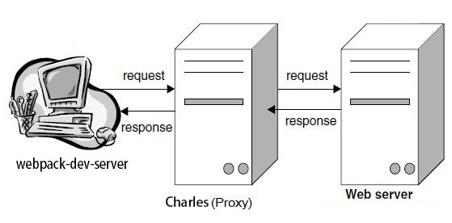

### charles相关配置如下：

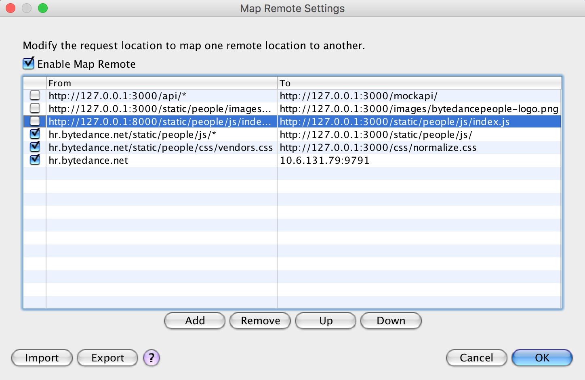

### 注意事项
要将webpack-dev-server与后端服务器结合使用，需要考虑如下两种场景：

* 如果HTML文件是从后端服务器发出的，这时页面的根地址变成了后端服务器地址，怎么使得webpack产生的资源文件在请求资源的时候是向web-dev-server请求而不是后端服务器请求？需要在webpack配置文件中的output.publicPath配置项写上绝对URL地址，例如output.publicPath = "http://127.0.0.1:3000/static/people/"。这时，webpack打包产生的资源文件里面的url地址都会是绝对地址，而不是相对地址，在生产环境中再切换成实际部署地址：'/static/people/'即可。

* 后端服务器产生的入口HTML文件要向webpack-dev-server请求资源文件（多用在开发联调阶段），只需在HTML文件中加入资源文件的绝对地址，例如：src="http://127.0.0.1:3000/assets//static/people/js/index.js"
 

### Hot Module Replacement
HMR简单说就是webpack启动一个本地webserver（webpack-dev-server），负责处理由webpack生成的静态资源请求,所有资源存储在内存的,所以编译和更新的速度度会比较快。

webpack官网对module、entry、chunk三者的关系以及webpack如何实现热更新的图示：

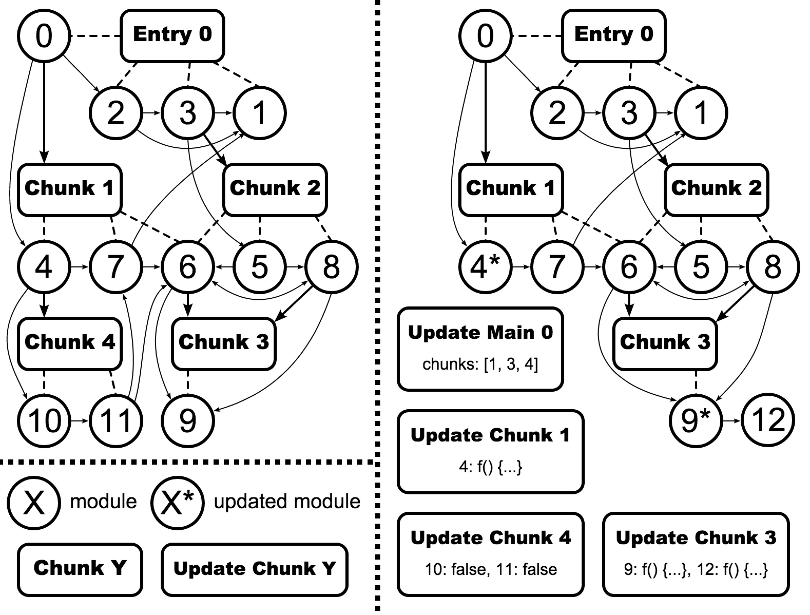

enter0表示入口文件，chunk1~4分别是提取公共模块所生成的资源块，当模块4和9发生改变时，因为模块4被打包在chunk1中，模块9打包在chunk3中，所以HMR runtime会将变更部分同步到chunk1和chunk3中对应的模块，从而达到hot replace。

webpack-dev-server的启动很简单，配置完成之后可以通过cli启动，然后在页面引入入口文件时添加webpack-dev-server的host即可将HMR集成到已有服务器：

```
webpack-dev-server --hot
```

启动HMR之后，每次保存都会重新编译生成新的chnuk，通过控制台的log，可以很直观地看到这一过程：

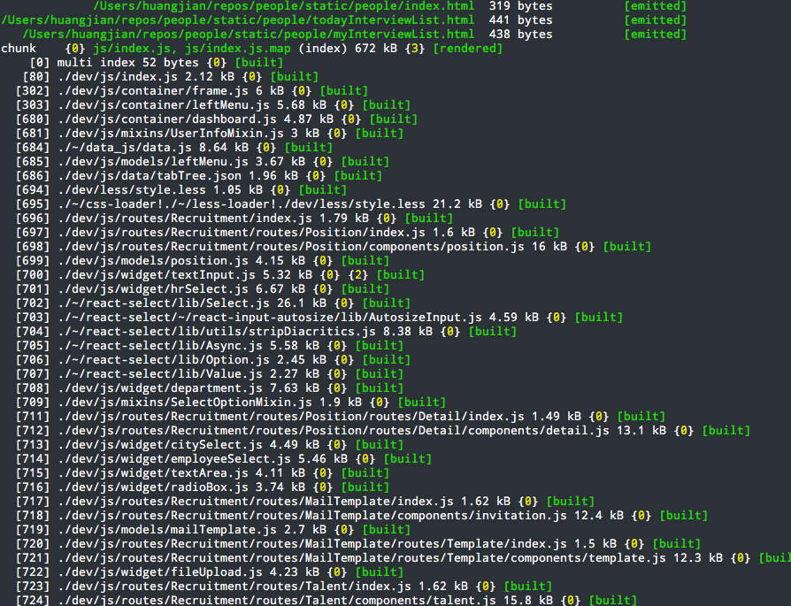

打开页面后可以在浏览器的控制栏里读到相关信息：

```
[HMR] Waiting for update signal from WDS...  dev-server.js?b7b7:60 
[WDS] Hot Module Replacement enabled.        client?4854:19
```

HMR前缀的信息由webpack/hot/dev-server模块产生，WDS前缀的信息由webpack-dev-server客户端产生。

更多关于HMR的相关资料可以参阅：

* [hot-mode](http://webpack.github.io/docs/webpack-dev-server.html#hot-mode)
* [HMR](http://webpack.github.io/docs/hot-module-replacement.html)

### DevTool

### 前端数据模拟(Mock)
在开发过程中为了实现前后端的解耦开发，我们可以在将mock server和webpack做些结合，方便的为前端项目提供各类模拟数据，同时也能做到前端工程不依赖服务端的环境，灵活迁移。

安装mockserver：

```
$ npm install fms --save dev
```

编写mock数据脚本：

```js
// mock data
var Mock = require('mockjs');
var listData = Mock.mock({
  'list|1-40': [{
    'id|+1': 1,
    'description': 'sad',
    'hr': [
      {
        'name': '@name',
        'id': 12
      }
    ],
    'direct_leader_id': 54,
    'direct_leader': '钱绮琪',
    'city': '成都',
    'name': '\b服务端开发工程师',
    'position_type': '全职',
    'department': {
      'id': '288980000000098057',
      'name': '业务研发Web'
    },
    'large_department': {
      'id': '288980000000086281',
      'name': '业务研发'
    }
  }]
});

var mockData = {
  type: 'get',
  title: 'positionList',
  url: '/mockapi/recruitment/position/list/',
  request: {
    limit: 10,
    offset: 0
  },
  res: {
    success: {
      success: true,
      count: 40,
      positions: listData.list
    },
    fail: {
      success: false,
      msg: 'error happen'
    }
  }
};

module.exports = mockData;


// fms server config
var fms = require('fms');
var util = require('util');
var common = require('./api/common');
var recruitment = require('./api/recruitment');
var employee = require('./api/employee');
var employeeInfo = require('./api/employee_info');

var fmsData = {

  setting: function (port) {
    fms.run({
      port: port || 3001,
      root: process.cwd()
    });
  },

  recruitment: function () {
    fms.ajax(recruitment.position.list);
    fms.ajax(recruitment.mail_template.list);
  },

  start: function (port) {
    this.setting(port);
    this.common();
    this.recruitment();
    this.employee();
    this.employee_info();
  }
};
module.exports = fmsData;
```

运行mock server

```js
var mockServer = require('./mock/mockServer');
mockServer.start(3001);
```

推荐将运行命令写在gulp中，即能以gulp的指令方式运行：

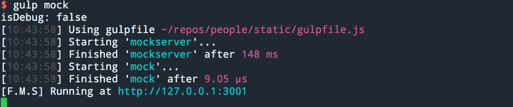

通过访问:<strog>http://127.0.0.1:3001</strong>可以打开fms的系统管理界面并进行相关mock数据配置：

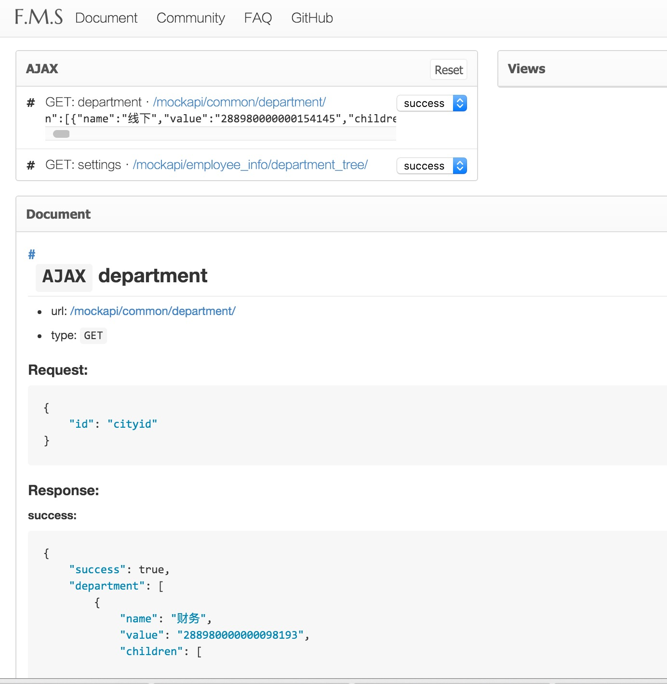

webpack-dev-server中的配置如下：

```js
module.exports = {
  entry: './main.js',
  output: {
    filename: 'bundle.js'
  },
  devServer: {
    port: 3000,
    host: '127.0.0.1',  // 注入页面的资源地址
    contentBase: './dev', // server访问的根路径
    proxy: {
      '/mockapi/*': {
        // 将页面api用charles代理到mockapi
        // 然后自动匹配到：http://127.0.0.1:3001/mockapi/
        target: 'http://127.0.0.1:3001',
        secure: false
      }
    }
  }
};
```

在devServer中加入一个代理接口映射，当页面api被转发到/mockapi/*，会自动访问到mock server的数据。


### 与gulp结合
webpack是一个非常强大的资源管理和构建工具，但是他同样也能很方便的与其他的构建工具进行结合，成为其指令的一部分。

```
npm install gulp-webpack --save dev
```

在gulpfile.js编写工作指令：

```js
var webpack = require('gulp-webpack');
var webpackConfigProd = require('./webpack.config.prod');
gulp.task('webpack', function () {
  return gulp
    .src(devPath)
    .pipe(webpack(webpackConfigProd))
    .pipe(gulp.dest(distPath));
});
```

更多相关介绍可以查看：

* [usage-with-grunt](http://webpack.github.io/docs/usage-with-grunt.html)
* [usage-with-gulp](http://webpack.github.io/docs/usage-with-gulp.html)
* [usage-with-bower](http://webpack.github.io/docs/usage-with-bower.html)
* [usage-with-karma](http://webpack.github.io/docs/usage-with-karma.html)


### 性能优化
关于webpack的性能优化相关建议可以查看AlloyTeam的[十大webpack使用优化建议](http://www.alloyteam.com/2016/01/webpack-use-optimization/)

### webpack2.0新特性
webpack2.0已经进入beta阶段，可以通过[Webpack 2 有哪些新东西](https://github.com/cssmagic/blog/issues/58#rd)来了解webpack最新的一些特性和功能。

## 小结
webpack以一种相对优雅的方式解决了前端资源依赖管理的问题，它在内部已经集成了许多资源依赖处理的细节，但是对于使用者而言只需要做少量的配置，再结合构建工具，很容易搭建一套前端工程解决方案。

基于webpack的前端自动化工具，可以自由组合各种开源技术栈（Koa/Express/其他web框架、webpack、Sass/Less/Stylus、Gulp/Grunt等），没有复杂的资源依赖配置，工程结构也相对简单和灵活。

